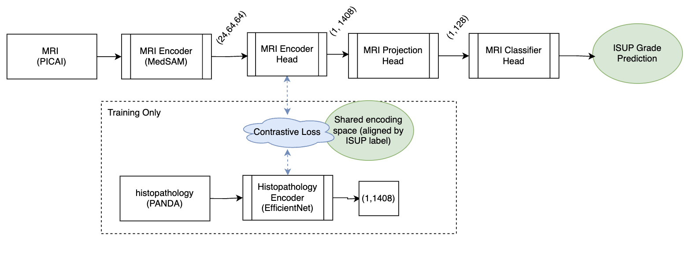

Architecture:

Repository Structure:
 - This repo contains a lot of different experiments and codebases, most of which didn't go anywhere. The most final, polished experiments are in `mri_model_medsam_finetune_2D/LATEST`
 - This paper describes the key experiments https://www.spiedigitallibrary.org/conference-proceedings-of-spie/13929/139290C/MRIhistopathology-alignment-for-improved-ISUP-grading-in-prostate-MRI/10.1117/12.3087820.full
 - The SPIE results are in `./mri_model_medsam_finetune_2D/LATEST/SPIE-RESULTS: results_isup3`
 - Script to submit a job: `./mri_model_medsam_finetune_2D/LATEST/submit.sbatch`

The data can be found on Killarney here:
 - MRI slices: `/project/aip-medilab/shared/picai/picai_prepped_registered`
 - MRI labels: `/project/aip-medilab/shared/picai/manifests/slices_manifest.csv`
 - Histopathology slice embeddings (output of the MIL-Lab training below): `/project/aip-medilab/shared/picai/histopathology_encodings/UNI2/projected_512D/embeddings_512`
 - Histopathology labels: `/project/aip-medilab/shared/picai/histopathology_encodings/UNI2_splits`
 - MedSAM checkpoint: `/project/aip-medilab/ewillis/pca_contrastive/mri_model_medsam_finetune/work_dir/MedSAM/medsam_vit_b.pth`

# HISTOPATHOLOGY DATASET:

The histopathology encodings come from: https://huggingface.co/datasets/MahmoodLab/UNI2-h-features/tree/main
"This dataset card provides the UNI2-h features for TCGA, CPTAC, and PANDA datasets with patch size 256 x 256 pixels at 20x magnification."

UNI2-h
Model type: Pretrained vision backbone (ViT-H/14 via DINOv2) for multi-purpose evaluation on histopathology images
Pretraining dataset: Over 200 million image tiles sampled from over 350k diverse H&E and IHC slides sourced from Mass General Brigham.
Repository: https://github.com/mahmoodlab/UNI
Paper: https://www.nature.com/articles/s41591-024-02857-3
License: CC-BY-NC-ND-4.0

@article{chen2024uni,
  title={Towards a General-Purpose Foundation Model for Computational Pathology},
  author={Chen, Richard J and Ding, Tong and Lu, Ming Y and Williamson, Drew FK and Jaume, Guillaume and Chen, Bowen and Zhang, Andrew and Shao, Daniel and Song, Andrew H and Shaban, Muhammad and others},
  journal={Nature Medicine},
  publisher={Nature Publishing Group},
  year={2024}
}

To reproduce the histopathology embeddings, clone the MIL-Lab repo https://github.com/mahmoodlab/MIL-Lab, then paste in and run the `./train-histopathology-MIL.py` script at the top level of this repo

# MRI DATASET:
mpMRI from here: https://pi-cai.grand-challenge.org/ 
They are split into 2D slices and labelled with the patient level ISUP grade. If the MRI sample has a lesion mask, all slices that do not intersect the mask are labelled ISUP Grade 0. The `picai-prep` script was used to register all sequences to the same space (https://github.com/DIAGNijmegen/picai_prep/tree/main) and then the slices were cropped to the provided prostate bounding box region. 

