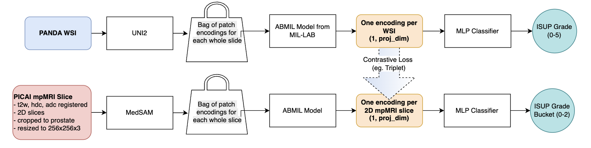

Pipeline:

# HISTOPATHOLOGY DATASET:

The histopathology encodings come from: https://huggingface.co/datasets/MahmoodLab/UNI2-h-features/tree/main
"This dataset card provides the UNI2-h features for TCGA, CPTAC, and PANDA datasets with patch size 256 x 256 pixels at 20x magnification."

UNI2-h
Model type: Pretrained vision backbone (ViT-H/14 via DINOv2) for multi-purpose evaluation on histopathology images
Pretraining dataset: Over 200 million image tiles sampled from over 350k diverse H&E and IHC slides sourced from Mass General Brigham.
Repository: https://github.com/mahmoodlab/UNI
Paper: https://www.nature.com/articles/s41591-024-02857-3
License: CC-BY-NC-ND-4.0

@article{chen2024uni,
  title={Towards a General-Purpose Foundation Model for Computational Pathology},
  author={Chen, Richard J and Ding, Tong and Lu, Ming Y and Williamson, Drew FK and Jaume, Guillaume and Chen, Bowen and Zhang, Andrew and Shao, Daniel and Song, Andrew H and Shaban, Muhammad and others},
  journal={Nature Medicine},
  publisher={Nature Publishing Group},
  year={2024}
}